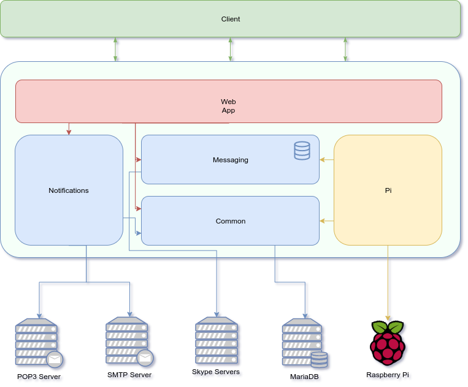

FoodBot is a system for communication between food providers (e.g. catering services or restaurants) and corporate users.
It manages the food provider's weekly menu and notifies its end-users via a Skype group.  

## Features
* Menu storage and management
* Automatic parsing and filtering of the newly received menu
* User review system
* Skype messaging via Skype Web Client and token caching
* Daily reminder at a configurable time
* Placeholder and configuration system
* Random daily greeting message
* Food delivery notification
* RESTful API
* Swagger endpoint documentation
* Hardware integration by utilising the Raspberry Pi GPIO pins 

## Overview
FoodBot stores a weekly menu given by the food provider. 
Based on the current day of the week and the configured time, it will send a reminder message to the predefined Skype group chat.

The actual message that is being sent can be fine-tuned using both system and user-defined placeholders. 
Before sending the message, FoodBot will replace the provided placeholders with actual data.

Food provider can notify the system of menu updates by email. 
FoodBot will try to parse the provided menu but will leave a copy of the original message.
A notification is then sent to each person marked as a reviewer.
Reviewers can modify the parsed values if needed and then publish the new menu.

### Hardware integration
If you are hosting the project on a Raspberry Pi, you can integrate its GPIO pins with FoodBot.
FoodBot can listen to button presses (the actual action is performed when the button is released) on a predefined GPIO pin.

When the food arrives, simply press the button and FoodBot will send a notification to the end-users' group and play a sound 
(via a buzzer connected to a GPIO pin) based on the message delivery status. The buzzer itself can be independently disabled in configuration.

## Getting started
The easiest way to run FoodBot is by using a precompiled package from the [Releases page](https://github.com/laxsrbija/foodbot/releases).

You also need to have Java 8 installed and fill out the configuration file. 
A sample FoodBot configuration can be found [here](https://github.com/laxsrbija/foodbot/blob/master/foodbot-webapp/src/main/resources/application.yaml).

FoodBot can use both an embedded in-memory H2 database or be configured to use an external server, like MariaDB.

Once the configuration process is complete, place the configuration file in the same folder as `foodbot.jar` 
and start the server with `java -jar foodbot.jar`. 
You can also provide a different configuration file location using the `--spring.config.location` flag.

Once the server is running, you can open http://localhost:8080 for further info.

## Starting a development version
If you want to develop or build FoodBot locally, make sure that Java 8 JDK and Maven are installed.

After cloning the project locally, copy the sample configuration file and place it in the project root directory as `application-dev.yaml`.
FoodBot comes with IntelliJ IDEA run configurations, so it will pick-up the configuration file automatically.

You can also set the active Spring profile to `development`, which will add an additional endpoint useful for development.

### Building the project
Build the project by performing a `mvn clean install`. 
A `foodbot.jar` will be generated in the target folder of the webapp module.

By default, the Raspberry Pi integration will not be included. 
To enable it, simply add a `-Prpi` flag when performing the build.

### Project architecture

